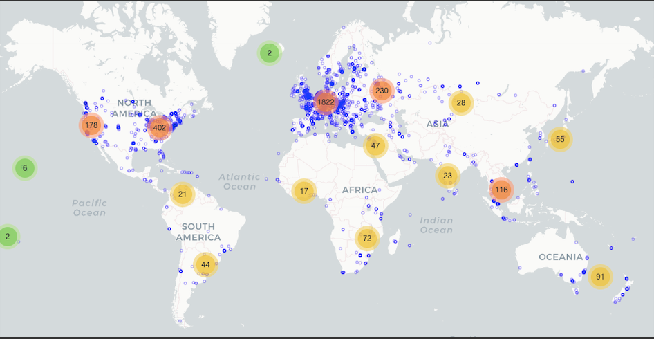

### Measuring DNS over TLS from the Edge: Adoption, Reliability, and Response Times

Trinh Viet Doan | Irina Tsareva | Vaibhav Bajpai  
Technical University of Munich

[PAM 2021](https://www.pam2021.b-tu.de/), March 29&ndash;31, 2021. [Pre-print &rarr;](https://home.in.tum.de/~doan/2021-pam-paper.pdf) 

---

### Vantage Points

The dataset is collected from ~5.2k RIPE Atlas probes, of which ~3.2k are home probes and considered for the analyses.
A map of these home probes is shown below.

### Dataset

The measurement results can be retrieved from the RIPE Atlas API through the measurement IDs, which are listed in the shared `sqlite3` database [`./data/main.db`](https://github.com/tv-doan/pam-2021-ripe-atlas-dot/blob/master/data/main.db), see tables `traceroutes` and `measurements`; the measurement results need to be stored in the `traceroute_measurements` and `results` tables, respectively.

The schemas of all tables can be found under [`./data/main.sql`](https://github.com/tv-doan/pam-2021-ripe-atlas-dot/blob/master/data/main.sql).

This repository contains (most of) the required code and metadata to reproduce the results, see below for further instructions.

### Requirements

To read from the database (see above), `sqlite3` is needed.
The analyses were performed using `jupyter` notebooks on `Python 3.6.9`.
Required Python dependencies are listed in [`requirements.txt`](https://github.com/tv-doan/pam-2021-ripe-atlas-dot/blob/master/requirements.txt) and can be installed using `pip3 install -r requirements.txt`.

For the calculation of CDFs and drawing of the corresponding plots, [`Pmf.py` &rarr;](http://greenteapress.com/thinkstats/Pmf.py) and [`Cdf.py` &rarr;](http://greenteapress.com/thinkstats/Cdf.py) from [Think Stats &rarr;](https://greenteapress.com/wp/think-stats-2e/) are used.

### Repeating the analysis
Download the raw measurement results from the RIPE Atlas API through the provided measurement IDs, e.g., using the Python modules `ripe.atlas.cousteau` and `ripe.atlas.sagan`:
- `main.db` (~20 GB after downloading results) &rarr; [`./data/`](https://github.com/tv-doan/pam-2021-ripe-atlas-dot/blob/master/data/)

Move the modules to the right locations:
- `Pmf.py` &rarr; [`./response-times/`](https://github.com/tv-doan/pam-2021-ripe-atlas-dot/blob/master/response-times/)
- `Cdf.py` &rarr; [`./response-times/`](https://github.com/tv-doan/pam-2021-ripe-atlas-dot/blob/master/response-times/)

Run the `jupyter` notebooks in the [`./preprocessing/`](https://github.com/tv-doan/pam-2021-ripe-atlas-dot/blob/master/preprocessing/) directory (in the specified order) to process and aggregate the raw dataset, which will store the results in separate databases in the [`./data/`](https://github.com/tv-doan/pam-2021-ripe-atlas-dot/blob/master/data/) directory. After that, the other notebooks in the [`./reliability/`](https://github.com/tv-doan/pam-2021-ripe-atlas-dot/blob/master/reliability/) and [`./response-times/`](https://github.com/tv-doan/pam-2021-ripe-atlas-dot/blob/master/response-times/) directories can be used to derive results presented in the paper.
All plots are saved under [`./plots/`](https://github.com/tv-doan/pam-2021-ripe-atlas-dot/blob/master/plots/).

Note: The required metadata lookups were already done and are stored in the [`./metadata/`](https://github.com/tv-doan/pam-2021-ripe-atlas-dot/blob/master/metadata/) directory.

### Contact

Please feel welcome to contact the authors for further details.

- Trinh Viet Doan (<doan@in.tum.de>) (corresponding author)
- Irina Tsareva (irina.tsareva@tum.de)
- Vaibhav Bajpai (<bajpaiv@in.tum.de>)
